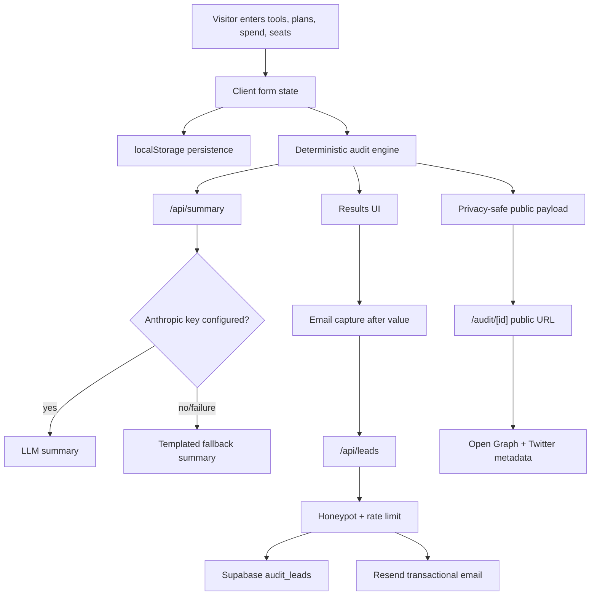

# Architecture

## Data Flow

The user enters team size, primary use case, and a list of paid AI tools. The form persists to `localStorage` on every edit, so refreshes do not lose progress. The audit engine normalizes the input, compares each line item against same-vendor plan rules, credible alternatives, and discounted-credit opportunities, then returns per-tool recommendations plus total monthly and annual savings.

The result is rendered immediately. In parallel, `/api/summary` asks Anthropic for a short CFO-friendly summary using only the deterministic audit result. If the API key is missing, the API fails, or Anthropic returns an unusable response, the app uses a templated summary.

Lead capture happens only after the audit is visible. `/api/leads` validates the email, rejects honeypot submissions, applies a simple in-memory IP limit, stores the lead in Supabase, and sends a Resend email. The public share URL is generated from a stripped payload containing no email, company name, or role.

## Stack Choice

I chose Next.js with TypeScript because the product needs both a polished interactive client flow and server behavior: API routes, public report pages, and dynamic metadata. TypeScript helps keep the audit engine explicit, while plain Node tests make the core logic easy for evaluators to run. I avoided a full auth system because the brief says no login is required.

## 10k Audits Per Day

For 10k audits/day, I would move rate limiting to Upstash Redis or Cloudflare Turnstile, store public reports by ID in Supabase instead of encoding them in URLs, queue transactional email through a background worker, add analytics events for funnel measurement, and split pricing data into versioned configuration with an admin review workflow. I would also cache LLM summaries by audit hash to avoid repeat API calls.
