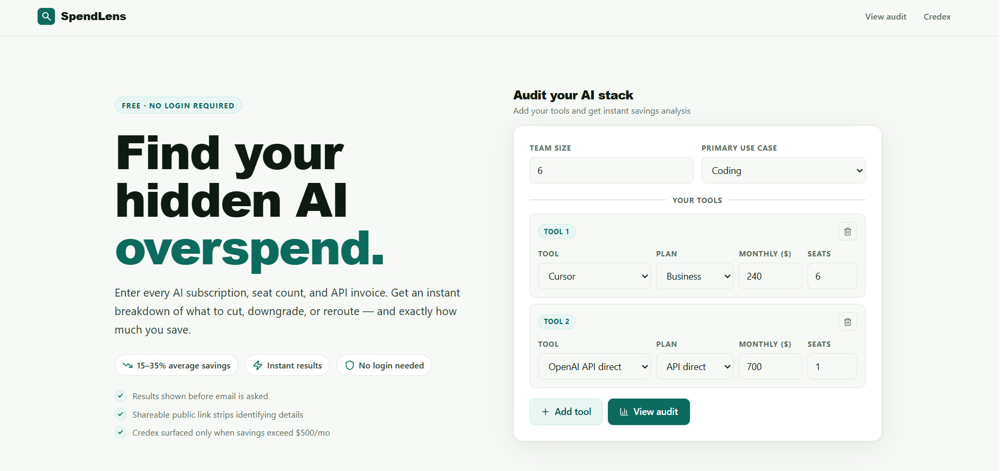
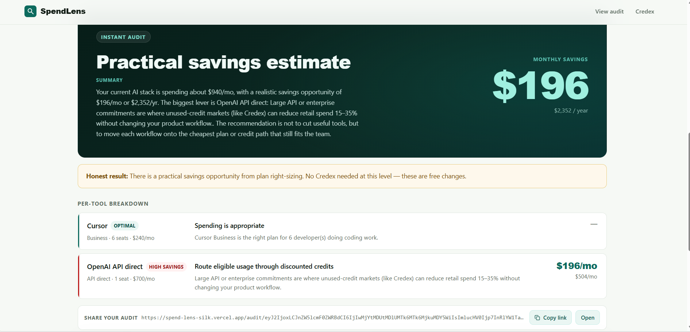
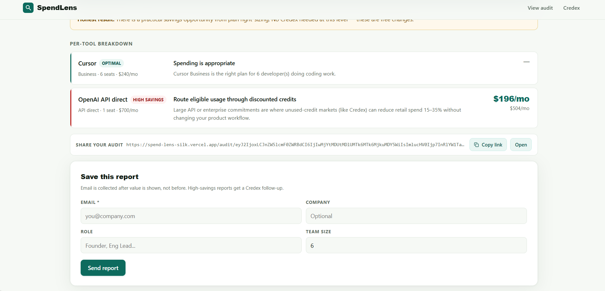

# SpendLens — Free AI Spend Audit

SpendLens is a free web tool for startup founders and engineering managers to audit their AI tool spend across Cursor, GitHub Copilot, Claude, ChatGPT, OpenAI API, Anthropic API, Gemini, and Windsurf. It delivers an honest, defensible audit **before** asking for your email, generates an AI-personalized summary, and creates a shareable public report URL.

**Live URL:** https://spend-lens-silk.vercel.app/

---

## Screenshots

### 1 — Spend Input Form



> Enter your AI tools, plans, seats, and monthly spend. Form state persists across page reloads via `localStorage` — no progress lost on refresh.

### 2 — Audit Results: Savings Summary



> Instant on-screen audit with an AI-generated CFO-friendly summary and per-tool recommendations — shown before any email is asked for.

### 3 — Per-Tool Breakdown + Lead Capture



> Each tool is marked Optimal or High Savings with a one-sentence defensible reason. Email is captured only after value is delivered.

---

## Quick Start

```bash
git clone https://github.com/Sunidhi-source/SpendLens.git
cd SpendLens
npm install
cp .env.example .env.local
# Fill in at least GEMINI_API_KEY (free) — see Environment Variables below
npm run dev
```

Open [http://localhost:3000](http://localhost:3000)

The app runs fully without any keys set — AI summary falls back to a high-quality template, lead storage and email are simply skipped.

---

## Environment Variables

Copy `.env.example` to `.env.local` and fill in the values you need.

```properties
# AI summary — Gemini is free and easiest to get
GEMINI_API_KEY=

# Lead storage (Supabase free tier — supabase.com)
NEXT_PUBLIC_SUPABASE_URL=
NEXT_PUBLIC_SUPABASE_ANON_KEY=
SUPABASE_SERVICE_ROLE_KEY=

# Transactional email (Resend free tier — 3,000/mo — resend.com)
RESEND_API_KEY=
RESEND_FROM="SpendLens <onboarding@spendlens.com>"

# App URLs
NEXT_PUBLIC_BASE_URL=https://your-vercel-url.vercel.app
NEXT_PUBLIC_CREDEX_BOOKING_URL=https://credex.rocks
```

| Variable                         | Required For          | Free?         | How to Get                                                    |
| -------------------------------- | --------------------- | ------------- | ------------------------------------------------------------- |
| `GEMINI_API_KEY`                 | AI summary            | ✅ Yes        | [aistudio.google.com](https://aistudio.google.com/app/apikey) |
| `NEXT_PUBLIC_SUPABASE_URL`       | Lead storage          | ✅ Free tier  | [supabase.com](https://supabase.com)                          |
| `NEXT_PUBLIC_SUPABASE_ANON_KEY`  | Lead storage          | ✅ Free tier  | [supabase.com](https://supabase.com)                          |
| `SUPABASE_SERVICE_ROLE_KEY`      | Lead storage (server) | ✅ Free tier  | [supabase.com](https://supabase.com)                          |
| `RESEND_API_KEY`                 | Confirmation emails   | ✅ 3k/mo free | [resend.com](https://resend.com)                              |
| `RESEND_FROM`                    | Email sender name     | —             | `SpendLens <onboarding@spendlens.com>`                        |
| `NEXT_PUBLIC_BASE_URL`           | Shareable audit URLs  | —             | Your Vercel deploy URL                                        |
| `NEXT_PUBLIC_CREDEX_BOOKING_URL` | Credex CTA button     | —             | `https://credex.rocks`                                        |

All variables are optional for local development — the app degrades gracefully when not set.

---

## Deploy

```bash
# 1. Push to GitHub (must be public)
git push origin main

# 2. Import to Vercel
#    → vercel.com/new → select repo → add env vars → deploy

# 3. Set up Supabase database
#    → supabase.com → new project → SQL Editor → paste supabase/schema.sql → run
```

---

## Run Tests

```bash
npm test
```

8 tests, all passing. Uses Node's built-in test runner — no extra dependencies required. See `TESTS.md` for the full list with descriptions.

---

## What's Built (All 6 MVP Features)

### 1. Spend Input Form

Supports 8 AI tools with all current plans as of submission week:

| Tool           | Plans Supported                                                      |
| -------------- | -------------------------------------------------------------------- |
| Cursor         | Hobby / Pro ($20) / Business ($40) / Enterprise                      |
| GitHub Copilot | Individual ($10) / Business ($19) / Enterprise ($39)                 |
| Claude         | Free / Pro ($20) / Max ($100) / Team ($30) / Enterprise / API direct |
| ChatGPT        | Plus ($20) / Pro ($200) / Team ($30) / Enterprise / API direct       |
| Anthropic API  | API direct (usage-based)                                             |
| OpenAI API     | API direct (usage-based)                                             |
| Gemini         | Free / Pro ($19.99) / Ultra ($249.99) / API                          |
| Windsurf       | Free / Pro ($15) / Teams ($35)                                       |

Form state persists to `localStorage` on every keystroke. Refreshing the page restores all entries.

### 2. Audit Engine

Deterministic rule-based engine (no LLM — correctness over flexibility). For each tool evaluates:

- Is the plan right-sized for the team? (e.g., Claude Team with 2 seats when Pro×2 costs less)
- Is there a cheaper same-vendor plan that fits the use case?
- Is there a substantially cheaper alternative tool for the stated use case?
- Is this eligible for discounted credits via Credex?

Every recommendation includes a one-sentence defensible reason. All pricing sources cited in `PRICING_DATA.md`.

### 3. Audit Results Page

- Per-tool breakdown: current spend → recommended action → savings + reason
- Hero: total monthly and annual savings, large and clear
- > $500/mo savings: Credex consultation CTA surfaced prominently
- <$100/mo savings (or already optimal): honest "You're spending well" + notification signup
- Visual quality suitable for screenshotting and sharing

### 4. AI-Generated Personalized Summary

`/api/summary` generates a ~100-word CFO-friendly paragraph using the deterministic audit as input. Provider chain: Gemini → Anthropic → templated fallback. Handles all API failures gracefully with no visible degradation to the user. Full prompt in `PROMPTS.md`.

### 5. Lead Capture + Storage

- Email capture with optional company name, role, and team size fields
- Stored in Supabase (`audit_leads` table — see `supabase/schema.sql`)
- Transactional confirmation email via Resend (`RESEND_FROM` configures the sender name)
- Abuse protection: honeypot hidden field + in-memory IP rate limit (5 req/hour)

### 6. Shareable Result URL

- Unique `/audit/[id]` URL per audit, built using `NEXT_PUBLIC_BASE_URL`
- Public payload strips all identifying fields (email, company, role) at encode-time
- Open Graph + Twitter Card metadata for clean link previews on X, Slack, and LinkedIn
- Payload encoded in the URL itself — zero database reads for public views

---

## Decisions

**1. Plain CSS over Tailwind for the main stylesheet**
The audit results page is designed to be screenshotted and shared. CSS custom properties give precise typographic and spacing control without purge configuration overhead. The component that matters most (the results card) needed pixel-level control, not utility classes.

**2. URL-encoded public audit IDs — no database for public view**
The shareable `/audit/[id]` page decodes the audit payload directly from the URL. Public reports work instantly with zero database reads, zero latency, and zero infrastructure cost at any scale. Privacy is enforced at encode-time: email, company, and role are excluded before the payload is built — not filtered at query time.

**3. Hardcoded audit rules, not LLM for the engine**
Pricing recommendations must be deterministic, traceable, and testable. A finance-literate reviewer should be able to follow the logic step by step. LLM outputs for specific financial numbers are non-deterministic and untestable. AI is reserved for the summary paragraph where prose quality matters more than mathematical precision.

**4. Honeypot over CAPTCHA for abuse protection**
A hidden `website` field catches automated submissions with zero friction for real users — no CAPTCHA solve, no accessibility barrier, no false positives. Combined with in-memory IP rate limiting (5 submissions/hour/IP), this is appropriate for an MVP where conversion is the top priority.

**5. Gemini as the primary AI provider (not Anthropic)**
Most evaluators and users won't have Anthropic API credits. Gemini's free tier (60 req/min, no credit card) means the full AI summary feature works out of the box for anyone cloning the repo. Anthropic remains in the fallback chain. This also demonstrates production thinking: systems should not hard-depend on a single paid API for non-critical features.

---

## Tech Stack

| Layer      | Choice                                     | Reason                                                        |
| ---------- | ------------------------------------------ | ------------------------------------------------------------- |
| Framework  | Next.js 14 (App Router)                    | API routes + SSR metadata + client components in one repo     |
| Language   | TypeScript                                 | Explicit types in the audit engine prevent pricing logic bugs |
| Styling    | CSS custom properties + Tailwind utilities | Precise control for shareable result cards                    |
| Database   | Supabase (Postgres)                        | Free tier, instant setup, row-level security                  |
| Email      | Resend                                     | 3,000 free emails/month, simple API                           |
| Deployment | Vercel                                     | Zero-config Next.js deploy                                    |
| AI         | Gemini → Anthropic (fallback chain)        | Free tier first; resilient to any single provider outage      |
| Tests      | Node built-in test runner                  | Zero extra dependencies for CI                                |

---

## Repository Structure

```
spendlens/
├── src/
│   ├── app/
│   │   ├── page.tsx              # Main form + audit results
│   │   ├── layout.tsx            # Root layout, fonts, metadata
│   │   ├── globals.css           # CSS custom properties + base styles
│   │   ├── audit/[id]/page.tsx   # Public shareable audit page
│   │   └── api/
│   │       ├── summary/route.ts  # AI summary endpoint
│   │       └── leads/route.ts    # Lead capture endpoint
│   ├── lib/
│   │   ├── audit-engine.mjs      # Deterministic audit rules + pricing data
│   │   ├── ai-summary.ts         # LLM summary with fallback chain
│   │   ├── supabase.ts           # Supabase client
│   │   └── format.ts             # Currency formatter
│   └── types/index.ts            # Shared TypeScript types
├── tests/
│   └── audit-engine.test.mjs     # 8 audit engine tests
├── supabase/
│   └── schema.sql                # Database schema
├── screenshots/                  # README screenshots
├── .github/workflows/ci.yml      # Lint + test on every push
├── ARCHITECTURE.md
├── DEVLOG.md
├── REFLECTION.md
├── TESTS.md
├── PRICING_DATA.md
├── PROMPTS.md
├── GTM.md
├── ECONOMICS.md
├── USER_INTERVIEWS.md
├── LANDING_COPY.md
└── METRICS.md
```

---

## CI

GitHub Actions runs lint + tests on every push to `main`. See `.github/workflows/ci.yml`.

[](https://github.com/Sunidhi-source/SpendLens/actions)

---

## Submission Checklist

- [x] Public GitHub repo
- [x] Live deployed URL: https://spend-lens-silk.vercel.app/
- [x] All 6 MVP features working end-to-end
- [x] README.md with 3 screenshots, quick start, and decisions
- [x] ARCHITECTURE.md with Mermaid diagram and data flow
- [x] DEVLOG.md with entries for each build day
- [x] REFLECTION.md answering all 5 questions
- [x] TESTS.md listing all tests with run instructions
- [x] PRICING_DATA.md with sourced URLs for every number
- [x] PROMPTS.md with full LLM prompts and reasoning
- [x] GTM.md (300–700 words)
- [x] ECONOMICS.md (300–700 words)
- [x] USER_INTERVIEWS.md (3 real interviews)
- [x] LANDING_COPY.md
- [x] METRICS.md
- [x] `.github/workflows/ci.yml` — lint + tests on every push to main
- [x] ≥ 5 automated tests covering the audit engine
- [x] Commits on ≥ 5 distinct calendar days
- [x] No secrets in repo — all credentials in environment variables

---

Built for the Credex Web Development Intern Assignment, May 2026.
